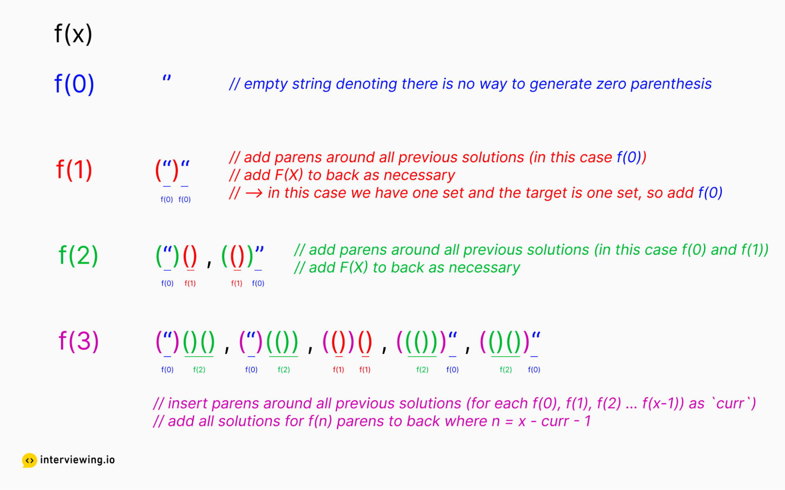

# Notes
My solution code for problems from 1 (two sum) to 50 (Pow (x,n)).

## Part1
This part includes solution code from problem 1 (two sum) to 5 (Longest Palindromic Substring).

For problem 1, 

- In this case, we could use c++ unordered map find(), which is faster than map.
- I noted down here that using {num1, num2} to return as vector would still improve the speed.

For problem 2, I choose not to change the original l1 and l2 pointer by initializing two temporary ptrs (just to be more safe) in the callee function. To save memory, just use the original l1 and l2. Another useful trick would be,

```c++
int val1 = (l1 == nullptr) ? 0 : l1->val;
int val2 = (l2 == nullptr) ? 0 : l2->val;
int sum = val1 + val2 + carryF;
```

For problem 3, use STL set by inserting right char and check the set if it is contained, then increasing left index.

For problem 4 (Median of Two Sorted Arrays), the request is an algorithm with time complexity of O(log(m+n)), so binary search algorithms are needed here. One trick to make the code quicker is to determine the size first and by recalling the function to simply swap the position of nums1 and nums2.

For problem 5 (Longest Palindromic Substring), a classical solution would be dynamic programming. I use two inner loop to check the two types of Palindromic string, one for pattern like \"aba\" those with central characters, and another one pattern "baab".


## Part2
Part2 marks the solution code for Problem 6. (Zigzag Conversion) to Problem 10. (Regular Expression Matching).

For P6. (Zigzag Conversion), write the index of each zigzag converted string, assume the numrows = 1, we can find that the index goes from 0123210123... Therefore, I use map to map each character into specitic rows, and use iterator to combine them together. Another solution would be directly assigning the char into specific index of zigzag converted results' string.

For P7. (Reverse Integer), note that the system does not allow us to use 64-bits long integer.
- One thing to note is that we may get runtime error, a trick to avoid is by checking the value > INT32_MAX / 10 or value < INT32_MIN / 10.

For P8. (String to Integer (atoi)), there are several tiny bugs we would make.
- Check overflow, the simple way is to declare long long int. But if we must use only int, we need to check whether the result is larger then INT32_MAX/10, when it equals INT32_MAX, the next integer must not be greater than 7. (INT32_MIN=-2147483648, and INT32_MAX=2147483647)

For P9. (Palindrome Number), the brute-force solution, we can use vector to store each digit. Smarter way is to reverse the integer and check overflow (we can use long long int to avoid this).

For P10. (Regular Expression Matching), for the recursive solution, there are two main sub-problems,
- We first check curMatch = !s.empty() && (s[0] == p[0] || p[0] == '.'), and if p[1] happens to be \*, then we need to check curMatch && isMatch(s.substr(1), p). It is the case that s[0] repeats many times until new character comes. Another case is just to match s and p.substr(2), which means that \* matches empty character in s.
- For second case, simple, just s.substr(1) and p.substr(1).

However, I found the above recursive method encounters "Time Limit Exceeded" for cases like "aaaaaaaaaaaaaaaaaaa", p = "a\*a\*a\*a\*a\*a\*a\*a\*a\*b", which means leetcode server cannot allow temporary stacking too many recursive functions. 

So a quicker solution is to adopt dynamic programming by using loops. Let's use 2-dim bool vector dp[m+1][n+1] as example, if d[i][j] == true, the following conditions should hold:
- If p[j - 1] != '*', then dp[i-1][j-1] == true && s[i - 1] matches p[j - 1]
- If p[j - 1] == '*', then,
- 1. p[j-2] does not repeated and '*' should match empty character of s.
- 2. p[j-2] repeated many times.

Some cases:
- "mississippi" "mis*is*p*.", should be false.

## Part 3

Code for Problem 11. (Container With Most Water) to Problem 15. (3Sum).

For Problem 11. (Container With Most Water), not difficult, use two pointers, O(N) time complexity. 

For Problem 12. (Integer to Roman), I use a static roman number table.

For Problem 13. (Roman to Integer), a hashMap is used. 
- In the for loop, when dealing with cases s[i+1] > s[i], remember to add an additional 1 for the loop value i.

For Problem 14. (Longest Common Prefix), try first finding the shortest str and use its size for the main loop.
- One way to reduce the need of concatenating chars as did in my current (solution 1) code is to calculate the index.

For Problem 15. (3Sum), one difficulty is not to contain duplicate triplets. I use two pointers here.


## Part 4
Code for Problem 16. (3Sum Closest) to Problem 20. (Valid Parentheses)

For Problem 16. (3Sum Closest), the answer seems to be unique. 
- Try ranges::sort() by C++-20

For Problem 17. (Letter Combinations of a Phone Number), good practice for backtracing algorithms, both backtracing and iterative methods are implemented.

For Problem 18. (4Sum), some notations.
- Check overflow. (Use long long int for sum or subtraction to compute wanted values.)
- Deal with duplicates. 

For Problem 19. (Remove Nth Node From End of List), I use two pointers, with one goes to the end to count the length.
- Take care of last pointer, if you use *end = head, and then end goes to the last node. Simply set end = nullptr actually does $\color{red}{\text{NOT}}$ change the last node to nullptr, you just set end to nullptr. A right way to do is find its previous, and set its next to nullptr.

Problem 20. (Valid Parentheses), simple practice of stack.
- Take care of the order of push and pop logics.

## Part 5
Code for Problem 21. (Merge Two Sorted Lists) to Problem 25. (Reverse Nodes in k-Group).

For Problem 21. (Merge Two Sorted Lists), avoid for circular linked lists.

For Problem 22. (Generate Parentheses), I implement two solutions.
- Backtracing, which needs to take care of the number of left and right brackets in the recursive function.
- Dynamic programming. First initialize n+1 empty vectors, and then set dp[0] as only "" starting string. Adding parens into previous results.


For Problem 23. (Merge k Sorted Lists), basically two kinds of solutions.
- Brute-force, implement the mergeTwo and then merge the lists one by one.
- Adopt prirority queue (heap). 

For Problem 24. (Swap Nodes in Pairs), pay attention to node lost and circular list.

For Problem 25. (Reverse Nodes in k-Group), a more complex version of reversing the linked list.